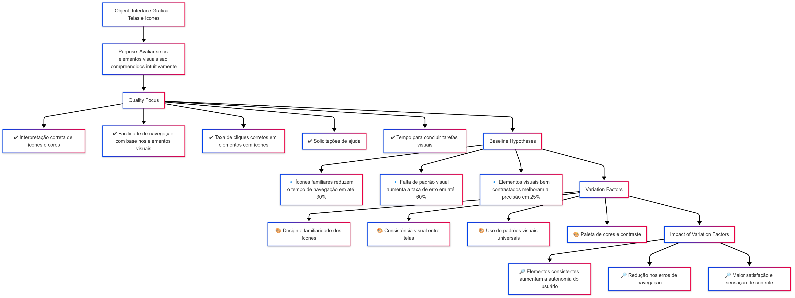

# 🎯 Objetivo do Negócio - AGROMART

Melhorar a **experiência do usuário (UX/UI)** com foco especial na **inclusão de agricultores com baixa alfabetização textual e digital**, por meio de **interfaces simples, acessíveis, visuais e intuitivas**, garantindo que mesmo usuários semi-analfabetos ou com pouca familiaridade com tecnologia consigam utilizar a plataforma com **autonomia e confiança**.

---

### 🔍 Enquadramento da Avaliação

| 🔎 | 📌 |
|----|----|
| **Analisa** | a interface do sistema AGROMART |
| **Para o propósito de** | avaliar o uso da ferramenta |
| **Com respeito a** | critérios de usabilidade |
| **Do ponto de vista de** | experiência do usuário |
| **No contexto de** | uma disciplina de Qualidade de Software |

---

# ❓ Questões Objetivo de Medição

## 🎨 Objetivo 1: Verificar a compreensão dos elementos visuais

### ❓ Perguntas

| 🆔 | 💬 Pergunta |
|----|------------|
| Q4 | Os usuários conseguem distinguir claramente os significados dos ícones e das cores utilizadas? |
| Q5 | As imagens e cores contribuem para a tomada de decisão durante a navegação? |
| Q6 | Há confusão entre elementos visuais com significados distintos ou sobreposição de funções? |

---

### 🧩 Diagrama

---

### 📋 Abstraction Sheet – Elementos Visuais

| **🔧 Elemento**              | **📝 Descrição** |
|-----------------------------|------------------|
| **🎯 Object** | Interface gráfica (telas e ícones) |
| **🎯 Purpose** | Avaliar se os elementos visuais (ícones, cores, imagens) são compreendidos de forma intuitiva pelos usuários |
| **📌 Quality Focus** | - Interpretação correta de ícones e cores - Facilidade de navegação com base nos elementos visuais - Taxa de cliques corretos - Solicitações de ajuda - Tempo para concluir tarefas visuais |
| **🧠 Baseline Hypotheses** | - Ícones familiares reduzem o tempo de navegação em até 30% - Falta de padrão visual aumenta a taxa de erro em até 60% - Elementos visuais bem contrastados melhoram a precisão em 25% |
| **🌀 Variation Factors** | - Design e familiaridade dos ícones - Consistência visual entre telas - Uso de padrões visuais universais - Paleta de cores e contraste |
| **📈 Impact of Variation Factors** | - Elementos consistentes aumentam a autonomia do usuário - Redução nos erros de navegação - Maior satisfação e sensação de controle |

---

## 📢 Objetivo 2: Avaliar a clareza dos feedbacks do sistema

### ❓ Perguntas

| 🆔 | 💬 Pergunta |
|----|------------|
| Q7 | Os feedbacks utilizados são percebidos pelos usuários? |
| Q8 | Os sinais do sistema são compreendidos? |
| Q9 | Os feedbacks ajudam a navegabilidade? |

---

### 🧩 Diagrama

---

### 📋 Abstraction Sheet – Feedbacks do Sistema

| **🔧 Elemento** | **📝 Descrição** |
|----------------|------------------|
| **🎯 Object** | Respostas da interface após ações do usuário |
| **🎯 Purpose** | Verificar se o sistema comunica corretamente o que está acontecendo |
| **👁️ Viewpoint** | Usuários que não compreendem mensagens de erro técnicas |
| **📌 Quality Focus** | - Presença de mensagens claras - Feedback visual/sonoro por ação - Padronização dos elementos de feedback - Alertas que previnem erros - Reconhecimento visual da mensagem aplicada |
| **🧠 Baseline Hypotheses** | - Mensagens claras reduzem a necessidade de suporte e diminuem erros - Feedback visual/sonoro imediato aumenta a confiança do usuário - Padronização do feedback reduz o tempo de aprendizado - Inconsistência nos feedbacks compromete a previsibilidade do sistema - Feedbacks padronizados promovem uma experiência fluida |
| **🌀 Variation Factors** | - Uso de linguagem simples - Tipos de feedback (visuais, sonoros) - Tempo de navegação em um fluxo de telas |
| **📈 Impact of Variation Factors** | Feedback claro e imediato aumenta confiança e reduz abandono de tarefas e o tempo de realização |

---

## 👥 Tabela de Contribuição

| 🎓 Matrícula | 🙋 Nome completo | 📊 Contribuição (%) |
|-------------|------------------|---------------------|
| 211030765 | [Guilherme Storch de Oliveira](https://github.com/storch7) | 16.66 |
| 222037610 | [Gabriel Lima da Silva](https://github.com/gabriel-lima258) | 16.66 |
| 222022000 | [Milena Fernandes Rocha](https://github.com/MilenaFRocha) | 16.66 |
| 222025324 | [João Lucas Araujo Siqueira](https://github.com/jlucasiqueira) | 16.66 |
| 222015248 | [Rafael Gomes Pereira](https://github.com/rafgpereira) | 16.66 |
| 222015112 | [Gabriel Reis Scheidt Paulino](https://github.com/Gxaite) | 16.66 |

---

## 📅 Histórico de Versões

| 📌 Versão | 📆 Data | ✍️ Descrição | 👤 Autor | 🔍 Revisor |
|:--------:|:-------|:-------------|:--------|:-----------:|
|`1.0`|22/05/2025|Criação da página inicial|[Gabriel Lima](https://github.com/gabriel-lima258)| [Guilherme Storch](https://github.com/storch7) |
|`1.1`|25/05/2025|Criação da tabela de contribuição|[Guilherme Storch](https://github.com/storch7)| [Milena Fernandes](https://github.com/milenafrocha) |
|`1.2`|26/05/2025|Ajustes e diagrama do objetivo 2|[Milena Fernandes](https://github.com/milenafrocha)| [Guilherme Storch](https://github.com/storch7)|
